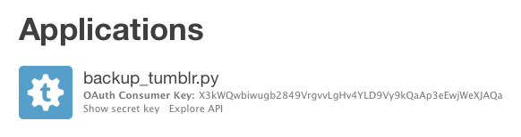

# backup_tumblr

This is a set of scripts for downloading your posts and likes from Tumblr.

The scripts try to download as much as possible, including:

*   Every post and like
*   All the metadata about a post that's available through the Tumblr API
*   Any media files attached to a post (e.g. photos, videos)

I've had these for private use for a while, and in the wake of Tumblr going on a deletion spree, I'm trying to make them usable by other people.


<sup>Pictured: a group of Tumblr users fleeing the new content moderation policies. Image credit: <a href="https://wellcomecollection.org/works/depa2hf5">Wellcome Collection</a>, CC BY.</sup>

## Getting started

1.  Install Python 3.6 or later.
    Instructions on [the Python website](https://www.python.org/downloads/).

2.  Check you have pip installed by running the following command at a command prompt:

    ```console
    $ pip3 --version
    pip 18.1 (python 3.6)
    ```

    If you don't have it installed or the command errors, follow the [pip installation instructions](https://pip.pypa.io/en/stable/installing/)

3.  Clone this repository:

    ```console
    $ git clone git@github.com:alexwlchan/backup_tumblr.git
    $ cd backup_tumblr
    ```

4.  Install the Python dependencies:

    ```console
    $ pip3 install -r requirements.txt
    ```

5.  Get yourself a Tumblr API key by registering an app at <https://www.tumblr.com/oauth/apps>.

    You need the **OAuth Consumer Key** from this screen:

    

## Usage

There are three scripts in this repo:

1.  `save_posts_metadata.py` saves metadata about all the posts on your blog.
2.  `save_likes_metadata.py` saves metadata about all the posts you've liked.
3.  `save_media_files.py` saves all the media (images, videos, etc.) from those posts.

They're split into separate scripts because saving metadata is much faster than media files.

You should run (1) and/or (2), then run (3).
Something like:

```console
$ python3 save_posts_metadata.py

$ python3 save_likes_metadata.py

$ python3 save_media_files.py
```

If you know what command-line flags are: you can pass arguments (e.g. API key) as flags.
Use `--help` to see the available flags.

If that sentence meant nothing: don't worry, the scripts will ask you for any information they need.

## Unanswered questions and notes

*   I have no idea how Tumblr's content blocks interact with the API, or if blocked posts are visible through the API.

*   I've seen mixed reports saying that ordering in the dashboard has been broken for the last few days.
    Again, no idea how this interacts with the API.

*   Media files can get big.
    I have ~12k likes which are taking ~9GB of disk space.
    The scripts will merrily fill up your disk, so make sure you have plenty of space before you start!

*   These scripts are provided "as is".
    File an issue if you have a problem, but I don't have much time for maintenance right now.

*   Sometimes the Tumblr API claims to have more posts than it actually returns, and the effect is that the script appears to stop early, e.g. at 96%.

    I'm reading the `total_posts` parameter from the API responses, and paginating through it as expected -- I have no idea what causes the discrepancy.

## Licence

MIT.
